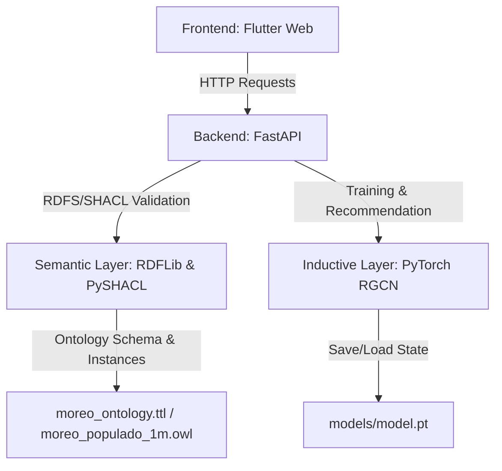

# 🎬 MORE: Movie Recommendation Ontology & Inductive Reasoning System

[](https://www.python.org/)
[](https://fastapi.tiangolo.com/)
[](https://flutter.dev/)
[](https://pytorch.org/)
[](https://www.docker.com/)

O **MORE** é um sistema híbrido de recomendação de filmes que combina a expressividade da **Web Semântica** (Ontologias, OWL, SHACL e inferência lógica) com o poder preditivo de redes neurais em grafos (**GNN - Relational Graph Convolutional Networks**). 

O projeto implementa uma arquitetura desacoplada e moderna, permitindo a ingestão e validação semântica de dados, treinamento indutivo em grafos de conhecimento e recomendações personalizadas por meio de uma interface interativa.

---

## 🏗️ Arquitetura do Sistema

O sistema é dividido em três componentes principais rodando de forma isolada e integrada via containers:



1. **Camada de Apresentação (Frontend):** Aplicação interativa em **Flutter Web** que consome os serviços do backend para registrar usuários, submeter notas, rodar validações e obter recomendações.
2. **Camada de Serviços (Backend API):** Servidor **FastAPI (Python)** que orquestra as operações da ontologia e o ciclo de vida do modelo preditivo.
3. **Camada Semântica (Semantic Web):** Gerenciamento e validação da ontologia com **RDFLib** e regras **SHACL Shapes** com **PySHACL**.
4. **Camada Indutiva (Deep Learning):** Modelo **R-GCN (Relational Graph Convolutional Network)** treinado para predizer novas conexões e notas entre usuários e filmes no grafo de conhecimento.

---

## 🛠️ Tecnologias Utilizadas

* **Linguagem Principal:** Python 3.10
* **Framework Web:** FastAPI (com Uvicorn e CORS habilitados)
* **Interface do Usuário:** Flutter Web
* **Manipulação de Grafos e Ontologias:** rdflib, owlready2, PySHACL
* **Deep Learning (GNN):** PyTorch, DGL (Deep Graph Library) / PyTorch Geometric
* **Containerização:** Docker / Podman (Rootless compatível)
* **Ambiente de Servidor Web:** Nginx (para hospedar o Flutter Web compile)

---

## 🚀 Como Executar o Projeto

O projeto está totalmente dockerizado, necessitando apenas do **Docker** (ou **Podman**) e do **Docker Compose** instalados na máquina.

### 1. Clonar o Repositório e Acessar a Pasta
```bash
git clone https://github.com/TheHugoHypothesis/MORE.git
cd MORE/system
```

### 2. Subir os Containers
Execute o comando abaixo para compilar as imagens e inicializar os serviços do Backend (porta `8000`) e do Frontend (porta `8080`):

```bash
docker compose up --build
```
*(Caso utilize o Podman, substitua por `podman-compose up --build`)*

### 3. Acessar a Aplicação
* **Frontend (Web App):** Abra no navegador [http://localhost:8080](http://localhost:8080)
* **Documentação da API (Swagger UI):** Acesse [http://localhost:8000/docs](http://localhost:8000/docs)

---

## 📊 Principais Endpoints da API

* `POST /validate` - Executa a validação das instâncias da ontologia (`moreo_populado_1m.owl`) contra as regras SHACL definidas in `moreo_shacl.ttl`.
* `POST /train` - Dispara em background o processo de treinamento da rede neural R-GCN para aprendizado indutivo com base nas triplas da ontologia.
* `GET /train/status` - Consulta o andamento e métricas atuais do treinamento da GNN.
* `POST /users` - Registra um novo indivíduo na ontologia, mapeando-o para a classe `User` e instanciando sua identidade e preferências.
* `POST /ratings` - Registra uma nova nota de filme e gera as conexões correspondentes no grafo semântico.
* `POST /recommend` - Retorna recomendações personalizadas combinando filtros semânticos e predições induzidas pela GNN.

---

## 🛡️ Validação SHACL (Shapes Constraint Language)

A qualidade dos dados populados na ontologia é auditada contra o arquivo de regras **`moreo_shacl.ttl`**, que valida:
* Restrições de tipo de dados (ex: idade e scores como números inteiros).
* Integridade de cardinalidade (ex: cada avaliação deve ter exatamente um usuário e um filme associado).
* Estrutura de relacionamentos diretos e inversos de forma otimizada para evitar a necessidade de motores de inferência pesados em runtime.
